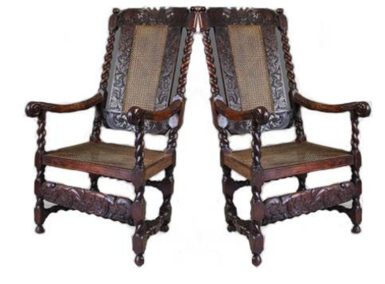
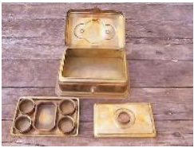

# The Chair

**Read the following story about a family that does not have a chair- (Perhaps, the entire village hasn’t seen a chair). The narrator amusingly narrates their plan of actions and the aftermath humorous incidents that happened after the arrival of the chair.**

A house without a chair?

Suddenly everyone in our house began to feel this way. That was it: it was put on the family “agenda” and discussions began.

The day before, a family friend had paid us a visit. He was a sub-judge. Couldn’t he have come like one of us, in a veshti and shirt? No, he arrived in “suitboot” and all. There was only a threelegged stool in our house. It measured a mere three-fourth foot; to churn curd, Paati, our grandmother, would sit only on it. She was quite heavy. Our grandfather had asked the carpenter to make it somewhat broader.

The sub-judge too was a little **portly**. Since we didn’t possess any other furniture, we brought that for him. Placing one hand on its edge, he made to sit down. One wretched thing about this stool: if you didn’t place the weight exactly above the legs, it would topple over. Ever so many times we had fallen down when we stood on it carelessly to steal ghee from the ropenet. Poor thing—just as we were about to caution the sub-judge, he fell down with a thud and rolled over. Me, my brother and my littlest sister couldn’t contain our giggles, so we ran to the back garden. Just as we thought our chuckles had subsided, our sister would mimic the sub-judge, leaning her hand and rolling on the floor. Our laughter only lengthened.

There was another reason for our giggles—the memory of our parents suppressing their giggles in front of the guest who had tumbled over.

So when we finished laughing on everyone’s behalf and pussyfooted into the house, the stout guest was not to be seen. And neither was the stool. “Did he take it away with him?” asked my sister to me.

After this incident, it was decided that a chair would be made for our home. The one practical difficulty in getting it made was that there wasn’t a single chair in our village to show as a model. Besides, there wasn’t a single carpenter either who knew how to make one.

“No problem. We can buy one from the town,” suggested my brother, Pedanna. Our father rejected it, saying it wouldn’t be sturdy.

Athai, our aunt, said that there was a skilled carpenter in the neighbouring village. That there wasn’t a chair he hadn’t made. And that the governor himself had praised him.

When my mother heard my aunt’s second sentence, she turned her face, as if to say, “Yes, yes, she’s seen everything!”

My father called a worker, despatched him to the carpenter’s village, and came and sat with us. Now there was discussion on the kind of wood to be used for the chair.

“Teak is the best. That’s what will be light to lift and carry around and be sturdy at the same time,” said our grandmother, pressing her stretched legs. (Our paati was extremely fond of her legs. She was forever stroking them.) 

At that moment, our maternal uncle, Maamanaar, walked in. Pedanna ran and brought the stool. For a while, the whole house **spluttered** into giggles before things settled down.

Maamanaar himself had chosen a spot to sit whenever he visited our house. Chop off his head, and he’d still sit there and nowhere else. He would lean against the pillar adjoining the wall to the south of the storeroom. The first thing he would do as soon as he sat down was to loosen his tuft, give it a good shake, scratch his head and tie it back tightly. He observed this ritual unfailingly. Then he would inspect the floor around him. “Didn’t see any money falling from your head,” Anna would say with an **impudent** smile.

He would always be pierced with such paper arrows whenever he visited us. He would sit mum with a smile, like a stone Pillaiyaar, as if to say, “You are my relatives—if you don’t tease me, who will?” When our ridicule overstepped the limits, Amma would pretend to chide us. The last word always ended in “you donkeys”.

As soon as Maamanaar sat down, Amma went towards the kitchen. Like a lamb, Appa followed her. In a while Amma appeared in the passage, a silver tumbler of buttermilk seasoned with asafoetida in her hand, followed by Appa, who, unseen by her, aped her movements for our benefit, as if to say, “Her brother has come, it seems. Look at her taking buttermilk for him with so much care.” The aroma of the buttermilk and the asafoetida made us want to drink it right away.

We believed that Maamanaar visited us mainly to drink buttermilk. The buttermilk from our cow was that divine. Besides, we thought that our uncle was the stingiest person in the village. We firmly believed he never gave away anything to anyone.

He himself had gone to Kannaavaram to buy this famed black-tongued milchcow for his sister. My younger brother and sister doted on its calf. Whenever he came over, and just before he left, he always went around the cow, gave it a pat (he was afraid his own evil eye would fall on it!), and uttered words of praise, even if he was thrifty with them. My little siblings always had this big fear that once the milk dried up, the cow would be taken away to his house, along with the calf. 

The anticipation of this imagined separation only increased their fondness for the calf and their bitterness towards Maamanaar. Whenever he relished the buttermilk, these small children punched and pinched with their very stares.

Maamanaar showed interest in the debate about the chair. He let it be known that he too would like one to be made for him. We too were glad to have a partner in this enterprise.

Maamanaar said that the neem tree was the best. It would keep the body cool.

When he **expounded** on the neem tree, Appa looked at him with round-eyed astonishment. Only the day before Appa had been talking to a farmhand about cutting down an ancient, diamond-hard neem tree in our cattle-pasture and laying it out to dry. Pedanna said, “Making it out of poovarasu wood would be really good. It’s a fine-grained wood, without knots. And glossy and strong too.” Our elder sister said, “All these are light-coloured woods. Ugly to look at! After a while, we’ll begin to even detest them. I’m saying it will be best to make it the colour of ripe sugarcane or dark like sesame oilcake. But it’s your wish…” The vision of a highly comfortable chair—in black wood with a mirror-like gleam, with perfectly shaped front legs, and curved back legs, yawning languorously, to match the recline of the chair—flashed before our eyes. 
 
 

Everyone felt that she was right. So it was arranged for two chairs to be made immediately, one for us and the other for Maamanaar.

When the two chairs arrived, we didn’t know which one to keep and which to send to Maamanaar. If you looked at one, you didn’t need to see the other— they were like Rama-Lakshmana. We kept one and sent the other to Maamanaar. We had a doubt: had we sent the better one to him?

One by one, we took turns to sit on the chair. Never felt like getting up from it. But had to because others too had to be given a chance. Pedanna sat and exclaimed appreciatively, “Ah…ha!” He ran his hands over the arms of the chair. He sat crosslegged on it. Athai said, “We have to stitch a cover for it. Otherwise it will get soiled.”

My little sister and brother fought over it frequently. She would shout at him, “You’ve been sitting on it for so long, get up. I want to sit now.”

“ Ayyo, I’ve just sat down. Look at her, Amma,” he would say, his face puckering, as if about to cry.

The news of the arrival of our chair spread like fire around the village. People— children and adults —arrived in **hordes** to see the chair. A few even stroked it. An old man lifted the chair. “Quite heavy. He’s made it sturdy,” he commended the carpenter.

A few days passed by.

One night, someone knocked on the door. Pedanna, who was sleeping in the inner  pial, opened the door. They said that an important person had just died in the village and that they needed the chair.

Since the deceased was also known to us, we too attended the funeral. It was on our chair that they had propped up the eminent person!

Till now in our village they always seated the corpse only on the floor. A grinding stone was laid on the floor and propped up to keep the corpse from rolling away. A gunny sack stuffed with millet straw would be rested against it. Against this bolster, the corpse would be placed as if reclining on it.

From where our townspeople picked up this new fad of propping up a corpse on a chair, we had no clue, but from that day troubles began for our chair. (They had moved from floor-tickets to chairtickets!)

When the “occasion” in that household was over, they left the chair in our front yard. The children of the house were scared even to look at the chair. We had the servant take it to the well and give it a good, hard scrub with hay, and wash it down with fifteen big buckets of water. Even after several days, no one had the guts to sit on it. We didn’t know how to bring it back into use.

Fortuitously, a guest visited our house one day. We had the chair brought for him. “Don’t bother, I’ll sit here,” he said, and went towards the cloth-mat. We were afraid that he would sit on the floor. The whole family persuaded him to sit on the chair. As soon as he sat down, my little brother and sister fled to the garden in the backyard. Now and then, they peeped in to see what happened to the man on the chair.

The next day a local elder dropped by and chose to sit on the chair on his own, bringing us even more relief. (“He’s rehearsing on the chair now itself,” whispered Pedanna in my ear!) This is how we “seasoned” the chair. First, the elders in the family sat on it. The children were still afraid. My little sister would beg my little brother, “Why don’t you sit on it first, da?” He would retort instantly, “Why don’t you sit and see?”

Suganthi, from the neighbouring street, came by and put her baby brother on the chair. It was only from then on that the children of our house sat on the chair without fear.

Again, one night someone died and they took away the chair. This happened ever so often. We sent away the chair with sadness. The mourners who came interpreted our sadness differently. They assumed that we too were mourning for the dead.

We were irritated that our sleep was being thus disturbed. Akka remarked one day, “God knows why these wretched people have to go and die at such unearthly hours!” Anna said **exasperatedly**, “Good chair we made. For the corpses of our village to sit on. Tchai!” “All because the chair was ordered at an inauspicious time,” said our aunt.

Pedanna finally thought of an idea. We kept it to the two of us.

Amma sent me on an errand to Maamanaar’s house one day. When I entered his house, there he was, sitting in **splendour** on his chair and popping betel leaves into his mouth. It was an interesting pastime in itself to see him prepare and chew the betel leaves. Carefully, with utmost gentleness so as not to injure it, he would open his beloved betel box. A span wide, an elbow long, and four fingers high, he would clean and burnish it every day till it shone like gold. He would reverently take out his **paraphernalia**, as if taking out things from a pooja-box. 

Though he wiped the betel leaves clean, he never pinched off the stalk. (So thrifty was he!) If he found a coarse leaf, he would strip the veins off. Which always made us think of the old riddle-chant about betel leaves:

Catch hold of Muthappan, strip off his spine, Smear him with fresh butter…

He would sniff the broken arecanut. Sniffing was supposed to ward off ‘intoxication’. Then he would blow on the nut. To get rid of invisible arecanut worms, that’s why. This sniffing and blowing, slow to begin with, would increase in speed, hand moving from nose to mouth, until with great noise,  oomoosh, oomoosh, it was popped into the mouth —tabak!

To find out how tidy a person is, all one has to do is to look at his limepaste  dabba. Where this was concerned, Maamanaar was unmatched. Even the excess lime-paste on his finger wasn’t wiped off unnecessarily on other objects. You could press his lime-paste  dabba  to your eyes with reverence. His Eveready torch, bought fifteen years ago, was still in use, bright and spanking new, as if bought just now. The one bought by our family at the same time had sprung a leak. Dented, yellowing and pitiable, it looked like a chronic patient about to die.

No one but him could use the chair in his house. The first thing he did as soon as he got up every morning was to wipe it. Had it to be shifted, he himself carried it and put it down carefully, as if placing down gently a mud pot brimming with water.

As soon as he saw me, Maamanaar greeted me, “Welcome, dear nephew! Won’t you have some betel?” Then he himself answered, “‘If schoolboys start chewing betel, chickens will start butting!”

I conveyed to him what Amma asked me to and returned home.

At an ungodly hour in the night, there was a knock on the door. Everyone at home was fast asleep. I woke up Pedanna.

A few people from a house of **bereavement** stood outside for the chair. Pedanna took them into the street. I too followed. When they finished telling us what they came for, Pedanna replied patiently, “Chair only, no? It’s in our Maamanaar’s house. Go and ask him, he will give it.” After sending them off, we returned home, chuckling noiselessly.

Tossing, Appa asked sleepily, “Who was it?”

“What else—some fellows want our bullocks for threshing.”

Pulling the bedsheet tightly over him, Appa turned and went back to sleep.

Now it was raining in Maamanaar’s forest!

After many days, when I visited Maamanaar, he was sitting on the floor preparing betel leaves. He greeted me with his usual smile and banter.

“What is this? You’re sitting on the floor! Where is the chair?” I searched around. Smearing the lime-paste on the back of the betel leaf, he looked intently at me and smiled. He then said calmly, “I asked them to keep the chair for that purpose alone. Anyway, you need one for that too, no?”

I didn’t know what to say. I hurried home to convey this news to Pedanna. But gradually, my steps slowed to an ordinary **gait**.

## About The Author

Rajanarayanan, popularly known by Tamil initials as Ki. Ra., is a Tamil folklorist and a prolific author. The short story ‘The chair’ is written in 1969 and its original title is ‘Naarkaali’ The novels Gopalla Grammam and its sequel Gopallapurathu Makkal are among his most acclaimed; he won the Sahitya Akademi award for the latter in 1991. As a folklorist, Ki. Ra. spent decades collecting folktales from the karisal kaadu and publishing them in popular magazines. In 2007, the Thanjavur based publishing house Annam compiled these folktales into a 944-page book, the Nattuppura Kadhai Kalanjiyam (Collection of Country Tales). As of 2009, he has published around 30 books. A selection of these were translated into English by Pritham K. Chakravarthy and published in 2009 as Where Are You Going, You Monkeys? – Folktales from Tamil Nadu.

## Glossary

**Portly**      - stocky

**Spluttered**  - cackled ,make a series of short sounds.

**Impudent** - disrespectful

**Expounded**   - explained

**Languorously**- lethargically.

**Hordes**   - crowd, masses

**Exasperatedly**  - annoyingly

**Splendour** - magnificence

**Paraphernalia** - things,stuffs

**Bereavement** - mourning, grief

**Gait** -  pace
